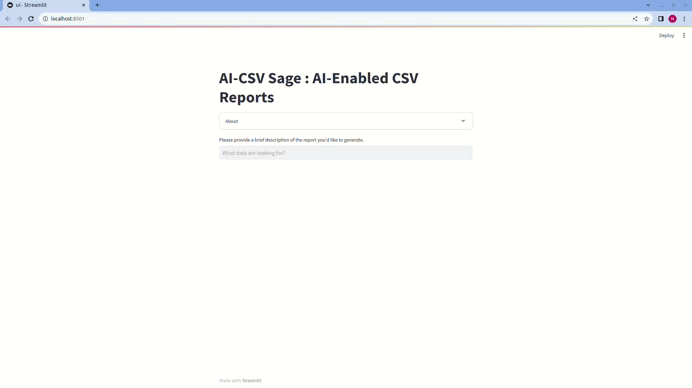

# AI-CSV Sage : AI-Enabled CSV Reports

## Demo

See how the tool works:



### Prerequisites

1. Make sure that [Python](https://www.python.org/downloads/) 3.10 or above installed on your machine.
2. Download and Install [Pip](https://pip.pypa.io/en/stable/installation/) to manage project packages.
3. Create an [OpenAI](https://openai.com/) account and generate a new API Key: To access the OpenAI API, you will need to create an API Key. You can do this by logging into the [OpenAI website](https://openai.com/product) and navigating to the API Key management page.

Then, follow the easy steps to install and get started using the sample app.

### Step 1: Clone the repository

This is done with the `git clone` command followed by the URL of the repository:

```bash
git clone https://github.com/pathway-labs/ai_csv_sage-pathwayl_lm_app
```

Next,  navigate to the project folder:

```bash
cd ai_csv_sage-pathwayl_lm_app
```

### Step 2: Set environment variables

Create `.env` file in the root directory of the project, copy and paste the below config, and replace the `{OPENAI_API_KEY}` configuration value with your key.

```bash
OPENAI_API_TOKEN={OPENAI_API_KEY}
HOST=0.0.0.0
PORT=8080
EMBEDDER_LOCATOR=text-embedding-ada-002
EMBEDDING_DIMENSION=1536
MODEL_LOCATOR=gpt-3.5-turbo
MAX_TOKENS=200
TEMPERATURE=0.0
SQL_DATABASE_SCHEMA_PATH="home/noor/Schema/schema.sql"
SQL_DATABASE_FILE_PATH="/home/noor/Documents/my_database.db"
```

Replace SQL_DATABASE_SCHEMA_PATH with your database schema file path , SQL_DATABASE_FILE_PATH with your database file and optionally, you customize other values.

### Step 3 (Optional): Create a new virtual environment

Create a new virtual environment in the same folder and activate that environment:

```bash
python -m venv pw-env && source pw-env/bin/activate
```

### Step 4: Install the app dependencies

Install the required packages:

```bash
pip install --upgrade -r requirements.txt
```


### Step 5: Run the Pathway API

You start the application by running `main.py`:

```bash
python main.py
```

### Step 6: Run Streamlit UI

You can run the UI separately by running Streamlit app
`streamlit run ui.py` command. It connects to the Pathway's backend API automatically and you will see the UI frontend is running on your browser.
